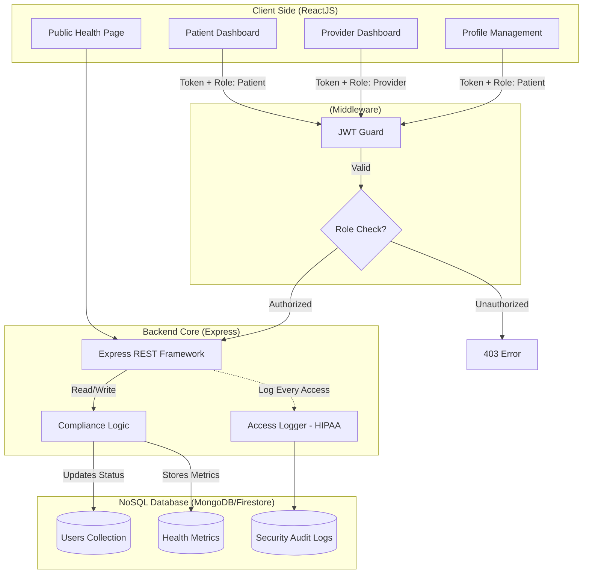
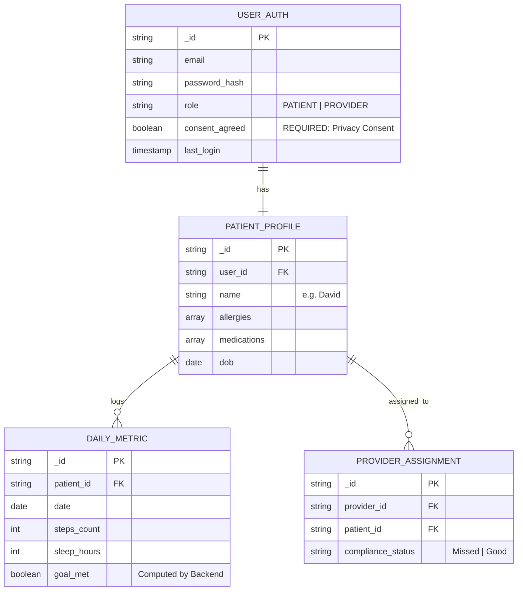

-----

# HCLTech Hack: Healthcare Wellness & Preventive Care Portal

## 1\. The "Fortress" Architecture Pattern

This solution uses a **Gateway Architecture**. The Frontend never touches the Database directly. All requests pass through a strictly typed Express REST Interface with JWT Authentication and granular permission checks.

### System Architecture Diagram

 This diagram separates the public face from private patient data.

-----

## 2\. Data Strategy (NoSQL Schema)

We utilize a split-schema approach to separate **Identity** from **Medical Data**.

### Entity Relationship Diagram

-----

## 3\. Tech Stack

  * **Frontend:** ReactJS (Vite or Create React App).
  *  **Backend:**Node Express (Express REST Framework).
  *  **Database:** NoSQL (MongoDB or Firestore).
  *  **Authentication:** JWT (JSON Web Tokens).
  *  **Deployment:** Cloud Platform (Vercel/Render/Heroku).

-----

## Overall Flow

## 4\. Key Feature Checklist (MVP)

###  A. Security & Authentication.

  * [ ] **Login/Register:** Separate flows for Patients and Providers.
  * [ ] **Data Consent:** Mandatory checkbox "I agree to data usage" during registration].
  * [ ] **JWT Sessions:** Secure token-based session management.
  * [ ] **Audit Logging:** Middleware to log every API access (HIPAA requirement).

###  B. Patient Dashboard & Profile.

  * [ ] **Profile Page:** View/Edit Name, Allergies, Current Medications.
  * [ ] **Wellness Goals:** Visual display of Steps taken vs. Goal (e.g., 3620/6000).
  * [ ] **Preventive Reminders:** Alert for "Upcoming Annual Blood Test".
  * [ ] **Goal Tracker:** Input form to log daily steps/sleep.

### C. Healthcare Provider View 

  * [ ] **Patient List:** List of assigned patients.
  * [ ] **Compliance Status:** "Traffic Light" indicator (Green = Goal Met, Red = Missed Checkup).

### D. Public Health Page 

  * [ ] **Static Info:** COVID-19 Updates, Seasonal Flu Prevention, Mental Health Awareness

-----

## 5\. The "Compliance Engine" Logic Flow

*Do not calculate compliance on the Frontend. It must be a backend process to ensure security.*

1.  **Patient Logs Data:** Patient sends `{ steps: 3000 }` to Express API.
2.  **Backend Verification:** API verifies JWT and checks if `consent_agreed` is True.
3.  **Calculation:** Backend compares `3000` vs `Goal (6000)`.
4.  **Status Update:** Backend saves the metric and updates the user's status to `Non-Compliant` or `Goal Met` in the database immediately.
5.  **Provider View:** When the doctor loads the dashboard, they simply read the status without doing math.

-----

## 6. Implementation Roadmap (5-Hour Plan)
**Hour 1: Foundation**

  * Initialize Express + React Repo.
  * Connect Database.
  * Build Auth API (Register/Login) with **Consent Checkbox**.

**Hour 2: Profile & Privacy**

  * Build `GET/POST /api/profile` (Allergies/Meds).
  * Create React Profile Page.
  * Implement Express Middleware for **Access Logging**.

**Hour 3: Dashboard & Metrics**

  * Build `POST /api/metrics`.
  * Create React Dashboard with "Welcome, [Name]" and Progress Bar.
  * Hardcode the "Preventive Care Reminder" (e.g., if date \> Jan 23, show alert).

**Hour 4: Provider View**

  * Build `GET /api/patients` (only accessible by `role: provider`).
  * Create Provider Dashboard Table (Highlight rows based on compliance status).

**Hour 5: Deployment & Polish**

  * Run Unit Tests.
  * Deploy Frontend to Vercel, Backend to Render/Heroku.
  * Add the Static Public Health Page.
